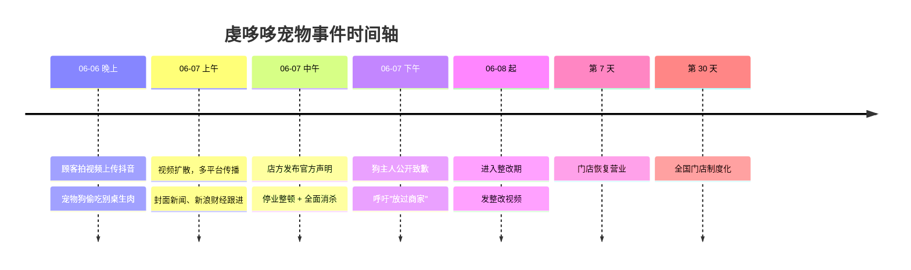
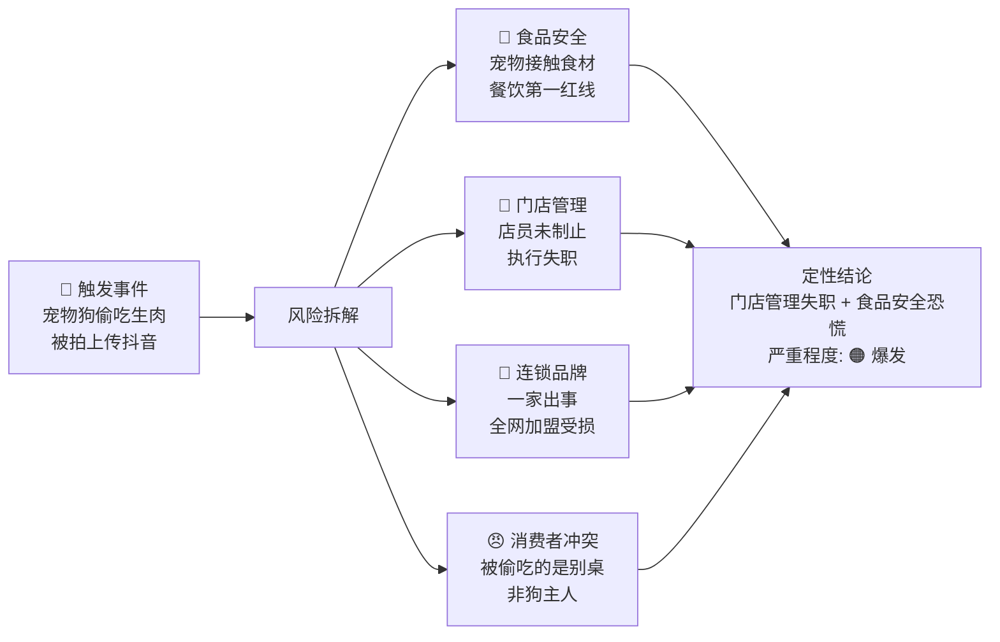
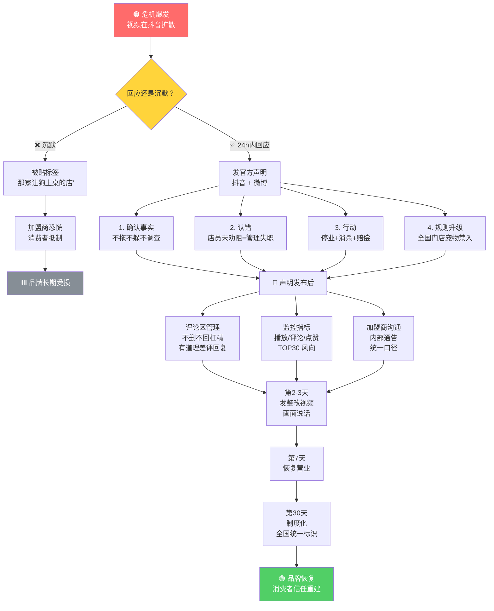
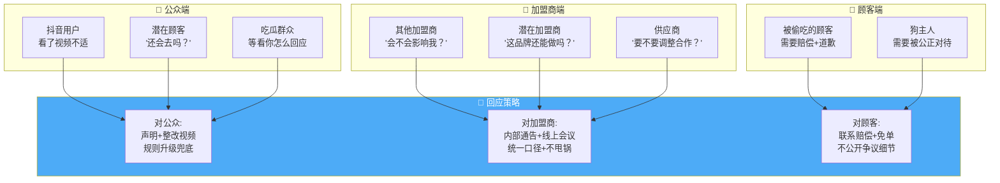
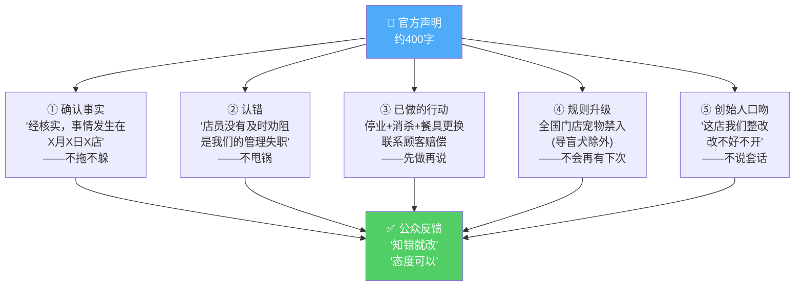
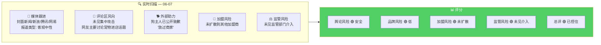
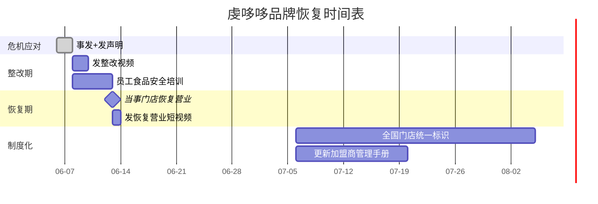

# 虔哆哆宠物事件 · 危机应对可视化报告

**事件**：宠物狗偷吃顾客生肉被拍上传抖音
**时间**：2026-06-06 事发 → 06-07 回应
**品牌**：湖南虔哆哆半肥瘦餐饮连锁有限公司
**严重程度**：🟠 爆发
**总评**：🟢 已控住

---

## 一、危机全流程时间轴



---

## 二、危机定性矩阵



---

## 三、危机决策树



---

## 四、三方利益相关方作战图



---

## 五、声明结构解剖



---

## 六、舆情监控仪表盘



---

## 七、恢复路线图



---

## 八、关键结论

### 做对了什么

1. **24 小时内回应**，不拖不等不调查
2. **认错不甩锅**，没说「是个别加盟商行为」
3. **规则升级** — 「宠物禁入」给了公众防止再犯的承诺
4. **狗主人致歉** — 外部助力替品牌分担火力
5. **不说套话** — 「改不好不开」比「深感抱歉」管用

### 可复用的框架

```
餐饮食品安全事件 回应公式 =
    确认事实（不拖）
    + 认错（不甩锅）
    + 行动（先做再说）
    + 规则升级（不会再有下次）
    + 创始人口吻（不说套话）
```

### 风险提醒

| 时间窗口 | 风险 | 应对 |
|----------|------|------|
| 声明后 24h | 追加负面曝光 | 准备二次回应口径 |
| 第 2-7 天 | 其他加盟商被扒 | 统一口径话术已就绪 |
| 第 7-30 天 | 恢复期口碑管理 | 持续高质量出品 |
| 长期 | 狗主人被网暴 | 发简短声明：「责任在我们，不在顾客」 |
