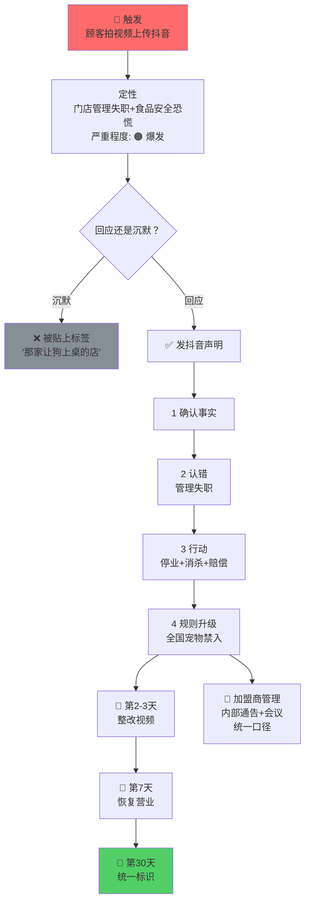

# 案例：某连锁餐饮品牌宠物事件

**日期**：2026-06
**类型**：门店管理失职 + 食品安全恐慌
**严重程度**：🟠 爆发
**对应 playbook**：food-safety

## 事件

顾客在某连锁烤肉店就餐时携带宠物狗入内。宠物狗偷吃了别桌顾客的生肉（未烤制前）。其他顾客拍摄视频上传抖音，迅速扩散。

## 核心风险

- 宠物接触食材 = 食品安全红线
- 连锁加盟模式 = 一家店出事，全网加盟商受损
- 被偷吃的是别桌顾客 = 消费者间冲突，不是宠物主人的个人行为
- 创始人 = 需对顾客、加盟商、公众三方负责

## 应对

### 声明（抖音发，400 字）

1. 确认事实 — 不拖不躲
2. 认错 — 店员未劝阻=管理失职
3. 行动 — 停业+消杀+赔偿+员工培训
4. 规则升级 — 全国门店宠物禁入就餐区（导盲犬除外）
5. 创始人口吻 — 「改不好不开」

### 后续

```
第 2-3 天：发整改视频（画面说话，不说话）
第 7 天：整改完毕恢复营业
第 30 天：全国门店统一标识
```

## 经验

1. 连锁品牌不甩锅给加盟商——「加盟商个人行为」在公众认知里 = 品牌推卸责任
2. 规则升级是最强的安抚——「这种事不会再发生」比「我们很抱歉」有用十倍
3. 创人口吻真诚 > 公关腔专业：抖音用户不傻，套话一眼看穿
4. 三条战线并行：顾客端（赔偿）+ 公众端（声明）+ 加盟商端（内部通告+统一口径）

## 可视化


